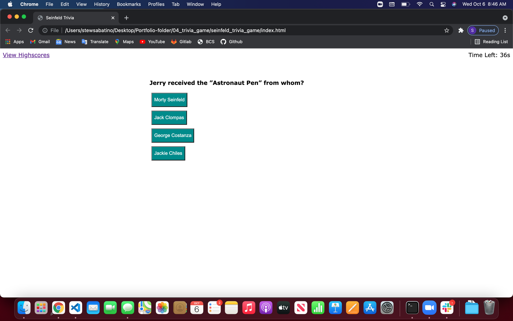

# seinfeld_trivia_game
* trivia game using html/css/javascript
* HTML - https://stewsabatino.github.io/seinfeld_trivia_game/
* Snippet - 


# GOALS
## Make HTML semantic elements to be accessible in css and javascript
    * Quiz start menu with button start with high scores
    * This includes form, button, parent div for card, divs with class card (h2, buttons, footer right or wrong when button clicked), header (view highscores and time remaining)
    * all done page with final score and place to put initials and submit

### CSS style buttons and card layout
    * styling submit buttons
    * flexing header

#### Javascript run through game, hide/visible/add content to HTML elements, set time, add scores and html element, save and call local storage
* time count down using 1000ms increments for seconds
```
var timerInterval;

function setTime() {
  // Sets interval in variable
    timerInterval = setInterval(function() {
    secondsLeft--;
    $countdown.textContent = "Time Left: " + secondsLeft + "s";
    // Once timer hits 0 save score to local storage and run score card function
    if (secondsLeft <= 0) {
        localStorage.setItem("score", secondsLeft)
        clearInterval(timerInterval)
        // Calls function to go to highscores
        scoreCard()

    }

  }, 1000);
}
```

* Saving scores to local storage 
    ```
    function storeInitials() {
        localStorage.setItem("scores", JSON.stringify(scores))
    }   
    ```

* Calling local storage 
```
    function storedScores() {
        var storedScores = JSON.parse(localStorage.getItem("scores"))

        if (storedScores !==null) {
            var $ul = document.createElement("ul");
            $card.appendChild($ul);
            var li = document.createElement("li");
            var initialsScore = storedScores
            li.textContent = initialsScore
            $ul.appendChild(li);
        }
    }
```

* Replace dom with new values to go through quiz
```
    var q1 = function () {
        console.log("start q1");
        $h1.style.visibility = "hidden"
        startBtn.remove();
        $h2.textContent = "Jerry received the ”Astronaut Pen” from whom?";
        ans1.style.visibility = "visible"
        ans1.dataset.state = "false"
        ans1.textContent = "Morty Seinfeld"
        ans2.style.visibility = "visible"
        ans2.dataset.state = "true"
        ans2.textContent = "Jack Clompas"
        ans3.style.visibility = "visible"
        ans3.dataset.state = "false"
        ans3.textContent = "George Costanza"
        ans4.style.visibility = "visible"
        ans4.dataset.state = "false"
        ans4.textContent = "Jackie Chiles"
    };
```

* When wrong subtract time from time left (8s)
* When right or wrong send out alert
```
    function wrongAnswer() {
        secondsLeft = secondsLeft - 8
        alert("WRONG ANSWER")
    }
```

* Run game function 
```
    function selectAnswer(event) {
        event.preventDefault();
        var element = event.target;

        // when a click is clicked in card element does it match a class .btn?
        if (element.matches(".btn")) {

            var state = element.getAttribute("data-state")
            // if the state is start then start the timer and run next question function
            if (state === "start") {
                console.log("start timer")
                setTime();
                nextQuestion();
            // if the state is true than alert that the answer is correct and run next question function
            } else if (state === "true") {
                alert("CORRECT ANSWER")
                nextQuestion();
            // if the state of btn press is not true or start run wrong answer function and next question function
            } else {
                wrongAnswer() 
                nextQuestion();
            }
        }
    };
```
